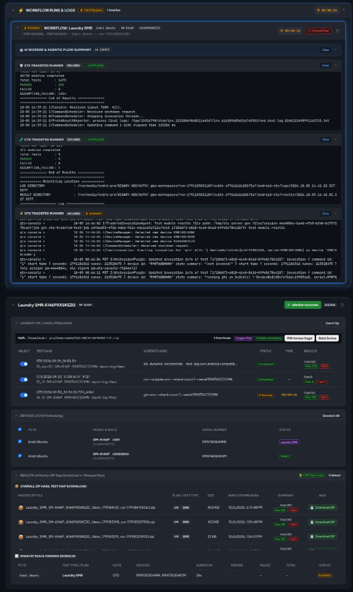
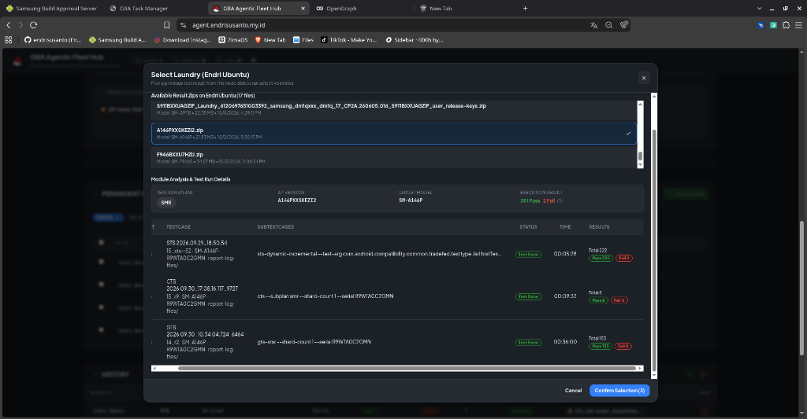

# GBA Agentic Hub & Agent Bridge

Distributed Android test automation system (CTS, GTS, STS, SKU, MR, SMR, and Laundry SMR) across remote Linux workstation nodes.

---

## Overview

GBA Agentic Hub coordinates Android compliance and regression test suites across multiple workstation PCs running native agent daemons (`agent-bridge`). Operators manage connected devices, trigger automated test runs, monitor live execution logs, and inspect test results from a central web dashboard.

---

## Architecture

```
                                  ┌───────────────────────────────┐
                                  │       GBA Agentic Hub         │
                                  │  (agent.endrisusanto.my.id)   │
                                  │  - Node.js + WebSocket Server │
                                  │  - React + Vite Web Client    │
                                  └───────────────▲───────────────┘
                                                  │
                                 WebSocket (/ws/bridge & /ws/ui)
                                                  │
                 ┌────────────────────────────────┴────────────────────────────────┐
                 │                                                                 │
  ┌──────────────▼──────────────┐                                   ┌──────────────▼──────────────┐
  │   Node Workstation 01       │                                   │   Node Workstation 02       │
  │   - agent-bridge (AppTray)  │                                   │   - agent-bridge (AppTray)  │
  │   - Tradefed Runner Engine  │                                   │   - Tradefed Runner Engine  │
  │   - Local AUTO Root & ADB   │                                   │   - Local AUTO Root & ADB   │
  └──────────────┬──────────────┘                                   └──────────────┬──────────────┘
                 │                                                                 │
        ┌────────┴────────┐                                               ┌────────┴────────┐
        ▼                 ▼                                               ▼                 ▼
  [Galaxy S24]      [Galaxy A55]                                    [Galaxy S23]      [Galaxy Z Fold]
```

---

## Repository Structure

```
agent/
├── web-hub/
│   ├── client/          # React, Vite, and TypeScript frontend dashboard
│   └── server/          # Node.js backend and WebSocket hub server
├── agent-bridge/        # Native Rust/Tauri client daemon with AppTray
├── docker-compose.yml   # Web Hub container deployment
├── build-deb.sh         # Linux .deb native packager script for agent-bridge
├── release.sh           # Automated versioning and git tagging script
└── package.json         # Monorepo workspace configuration
```

---

## AUTO Suite Root Directory Layout

On each test workstation node, prepare the `AUTO` root folder (`AUTO_ROOT`, default: `/run/media/endri-pro/BINARY_HDD/AUTO` or configured in `agent-bridge`):

```
AUTO/
├── CUCIAN/                     # Directory for test result ZIP files to be parsed by Laundry Engine
├── Results/                    # Output directory for test sessions, logs, and generated ZIPs
├── CTS/                        # Android Compatibility Test Suite packages
│   └── <Version>/              # Example: 14_r3, 15_r1, 16.1
│       └── android-cts/
│           └── tools/cts-tradefed
├── GTS/                        # Google Mobile Services Test Suite packages
│   └── <Version>/              # Example: 11_r1, 12_r2
│       └── android-gts/
│           └── tools/gts-tradefed
└── STS/                        # Security Test Suite packages (SPL Month / OS Version)
    └── <SPL_Month>/            # Example: 2026-08
        └── <AndroidVersion>/   # Example: 14, 15
            └── android-sts/
                └── tools/sts-tradefed
```

---

## Screenshots

| Desktop View | Mobile View |
| :---: | :---: |
|  |  |

---

## Core Features

### 1. Central Web Hub
- **Fleet State Aggregator**: Real-time tracking of connected bridge nodes, active jobs, and connected ADB devices.
- **Model Laundry Workflow**: Scans result ZIP archives, parses `test_result.xml` subtests, and allows operators to selectively retry failed modules with auto-collapsing form state upon execution.
- **Standby Devices Accordion**: Quick execution on idle devices with segmented plan switches (`SMR`, `SKU`, `NORMAL`, `STS`) and automatic `USERDEBUG`-only device enforcement for STS mode.
- **Runs & Logs Accordion**: Active run progress cards with live timers, child log drawers (`SUMMARY`, `STS`, `CTS`, `GTS`), and quick dismissal.
- **Terminal Logs Modal**: Real-time console log streaming with SVG copy, auto-scroll toggle, test result counters, and run cancellation.
- **History Results Explorer**: Searchable run history table with test result chips (`Pass`, `Fail`, `Total`) and direct ZIP download actions.

### 2. Native Agent Bridge (`agent-bridge`)
- **System Tray Daemon**: Runs in the background with close-to-tray protection to keep test sessions alive.
- **Device & Build Identification**: Reads device model, PDA, CSC, Android release, Security Patch Level, and build type (`USER` vs `USERDEBUG`).
- **Local Tradefed Execution**: Executes Tradefed suites directly on the workstation using isolated temporary workspaces (`.gba-workspaces/`); only logs and status updates stream to the Hub.

---

## Quick Start

### 1. Web Hub (Local Development)
```bash
# Install workspace dependencies
npm install

# Start both backend server (:4000) and frontend client (:3000)
npm run dev
```

### 2. Web Hub (Docker Compose Production)
```bash
# Build and run Web Hub in detached mode
docker compose build --no-cache && docker compose up -d

# Check status
docker compose ps
```
The Web Hub will be accessible at `http://localhost:4010` (mapped to container port 4000).

### 3. Agent Bridge (Workstation Client)
```bash
cd agent-bridge
cargo run
```

To specify custom Hub URL or workstation PC identifier:
```bash
HUB_URL=wss://agent.endrisusanto.my.id/ws/bridge PC_ID=NODE-01 AUTO_ROOT=/path/to/AUTO cargo run
```

### 4. Build & Install Debian Package on Node PCs
```bash
# Build .deb and install directly on the system:
npm run build:install
# or:
./build-deb.sh --install

# Build .deb without installing:
npm run build:deb
# or:
./build-deb.sh
```

---

## Automated Releases

To update versions, create git tags, and trigger GitHub Actions build pipelines:
```bash
# Patch release (e.g. 1.0.0 -> 1.0.1)
./release.sh patch "Description of changes"

# Minor release (e.g. 1.0.0 -> 1.1.0)
./release.sh minor "Feature update"
```

GitHub Actions automatically builds and publishes Linux packages to the [Releases](https://github.com/endrisusanto/agent/releases) page.
